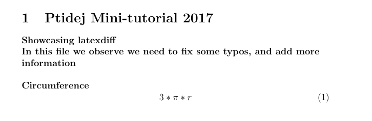
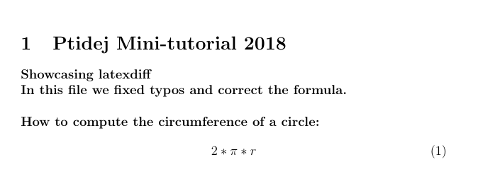
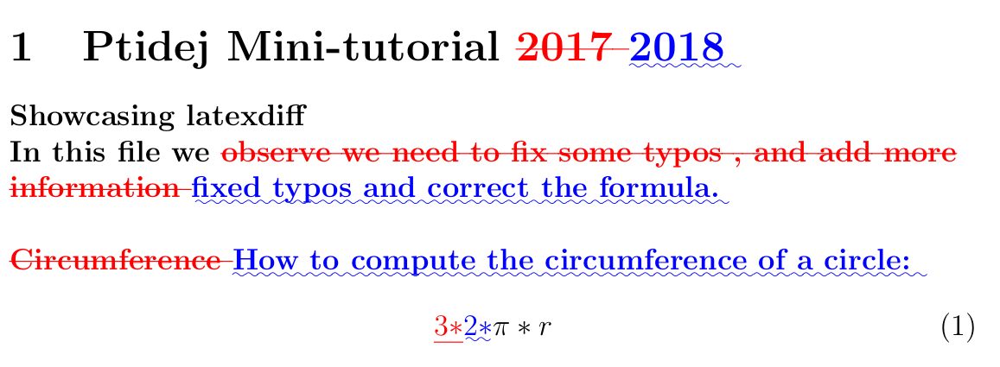

# latexdiff tutorial

Example:

For a simple example, suppose version 1 of our LaTeX document is the following: 

We notice a few errors, so we fix them in version 2 below: 

If we want to easily see the differences between the two versions, latexdiff will produce the following: 

## References

[1. overleaf](https://www.overleaf.com/learn/latex/Articles/Using_Latexdiff_For_Marking_Changes_To_Tex_Documents)
[2. git and latexdiff](http://www.deanbodenham.com/learn/git-and-latexdiff.html)
[3. How to calculate circumference of a circle, if you forgot how to](https://www.wikihow.com/Calculate-the-Circumference-of-a-Circle)
[4. To ignore certain environments in case of errors](https://tex.stackexchange.com/questions/73224/is-there-an-option-in-latexdiff-to-ignore-whole-environments)
[5. Main CTAN site](https://ctan.org/tex-archive/support/latexdiff)
